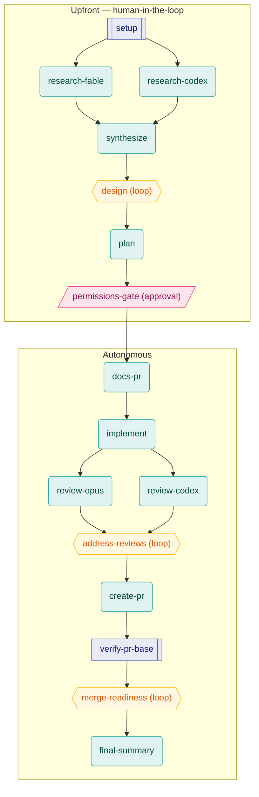

# feature-dev-governed — a clone-and-run Archon workflow harness

A portable, self-contained copy of the **`feature-dev-governed`** Archon workflow: a
governed, multi-phase feature-development pipeline that locks a strong design and plan
**upfront with a human in the loop**, then runs **autonomously** from implementation all
the way through to a merged, verified pull request. Clone this repo, drop the workflow
into your Archon install, point it at any git repo, and run it.

## Phases

**Upfront (human-in-the-loop):**

- **Research** — two models research the problem independently, in parallel (Claude + Codex).
- **Synthesis** — reconcile both researches into one confident recommendation.
- **Interactive design** — a collaborative loop where the agent asks *every* clarifying
  question. This is the last place questions get asked before autonomous execution.
- **Plan** — turn the agreed design into a complete, self-contained implementation plan
  with an explicit `[CODE]` vs `[MANUAL]` split and an auto-merge recommendation.
- **Permission gate** — a single approval gate: you approve the plan, authorize (or not)
  auto-merge, and decide who applies each manual step. Your answers are remembered for the
  rest of the run.

**Autonomous (runs to completion; only significant blockers pause it):**

- **Docs-first PR** — author the docs the repo's own convention calls for and open the PR
  early as a draft.
- **Implement** — a lead engineer dispatches parallel subagents for independent tasks and
  lands `[CODE]` steps into that same PR.
- **Dual-model review loop** — Claude and Codex review the diff independently; a loop
  addresses the relevant findings and re-verifies (Claude + a Codex second opinion) until
  both are satisfied.
- **Finalize PR** — fill the PR template, flip draft → ready.
- **Autonomous merge monitoring** — drive the PR to merged: Gemini comments, required CI,
  conflicts/rebase, conversation resolution, and (if you authorized it) auto-merge.

Only a genuinely **significant blocker** needing human input surfaces and halts the
autonomous phase; routine issues (waiting on CI, small review nits, rebases) are folded in
automatically.

## Workflow DAG

The node graph below is derived from the `depends_on` edges in
`.archon/workflows/feature-dev-governed.yaml`. Independent nodes in the same layer run
**concurrently** — `research-fable` ∥ `research-codex` both branch from `setup`, and
`review-opus` ∥ `review-codex` both branch from `implement`.



**Legend** — shapes/colors by node type: `[[double-bracket]]` blue = **bash** (deterministic
shell, no AI); `(rounded)` teal = **AI prompt** node; `{{hexagon}}` amber = **loop** node
(iterates until a completion signal — `design`, `address-reviews`, `merge-readiness`);
`[/parallelogram/]` pink = **approval** gate (`permissions-gate`, pauses for human approve/reject).

## Prerequisites

- [ ] **An Archon build that includes loop model/effort forwarding + the `xhigh` effort
      level.** Be aware: as of this writing that fix lives on the branch
      **`fix/loop-node-model-effort-forwarding`** in `coleam00/Archon` and is **NOT yet in a
      stock release**. Without it, the three loop nodes (`design`, `address-reviews`,
      `merge-readiness`) **silently fall back** to the default model/effort instead of the
      configured ones — the workflow still runs, but its loops are mis-modeled.
      **How to check:** run the workflow and grep the run log for `node_model_resolved`
      events (that event was added alongside the fix) to confirm each node's resolved
      model/effort. If those events are absent, or the loop nodes resolve to the wrong
      model, your build predates the fix.
- [ ] **Connected Claude AND Codex credentials.** Connect them with
      `archon ai key set <vendor>` / `archon ai login <vendor>`, and verify with
      `archon ai list`. This workflow uses both providers (Claude for most nodes, Codex for
      the two independent research/review nodes).
- [ ] **A connected GitHub identity.** The workflow declares `requires: [github]` and will
      hard-block before any cost on per-user-GitHub installs if your identity isn't
      connected (`archon auth github`). No-op on solo PAT installs.
- [ ] **The `codex` CLI on your PATH.** It's used for an independent second-opinion review
      inside the `address-reviews` loop (`codex exec ...`). If it's unavailable the loop
      records that and proceeds on Claude's own review rather than pretending it passed.
- [ ] **The target repo should have a `.github/PULL_REQUEST_TEMPLATE.md`.** The docs-first
      and finalize-PR nodes read it and fill it in.

## Install

This is a cross-project harness, so **global install is recommended** — it makes the
workflow available in every repo you work on.

### Global (recommended)

```bash
git clone <this-repo> archon-harness
cd archon-harness

# Symlink the workflow into your global Archon workflows dir (updates propagate):
./install.sh
# …or copy it instead of symlinking:
#   mkdir -p ~/.archon/workflows
#   cp .archon/workflows/feature-dev-governed.yaml ~/.archon/workflows/
```

Then merge the model config into your global config:

```bash
# If you have no ~/.archon/config.yaml yet, you can copy it wholesale:
#   cp .archon/config.example.yaml ~/.archon/config.yaml
# Otherwise, open both and merge the `assistants:` block by hand:
$EDITOR .archon/config.example.yaml ~/.archon/config.yaml
```

The workflow is now available in every git repo via `archon workflow run feature-dev-governed …`.

> **Note on aliases:** the optional `@aliases` block in `config.example.yaml` only resolves
> for **project-scoped** workflows. A globally installed workflow (in `~/.archon/workflows/`)
> **rejects** aliases. The default `opus`-based config needs no aliases and works globally.

### Per-project

Copy both files into a specific target repo and commit them so your team runs the exact
same process:

```bash
mkdir -p /path/to/your/project/.archon/workflows
cp .archon/workflows/feature-dev-governed.yaml /path/to/your/project/.archon/workflows/
# Merge .archon/config.example.yaml into /path/to/your/project/.archon/config.yaml
git -C /path/to/your/project add .archon/workflows/feature-dev-governed.yaml .archon/config.yaml
git -C /path/to/your/project commit -m "chore: add feature-dev-governed workflow"
```

At project scope you may also use the optional `@aliases` for distinct Claude models per
role (see below).

## Configure models

- **Claude nodes** default to `opus` (with `fallbackModel: sonnet`). To change the default,
  edit `assistants.claude.model` in your config, or edit the individual nodes' `model:`
  lines in the YAML.
- **Codex nodes** (`research-codex`, `review-codex`) carry **no** `model:` line — they
  inherit `assistants.codex.model` from your config. Set that to whatever Codex model your
  install actually has (`archon ai list`, or check `~/.codex/config.toml`). Codex effort is
  `modelReasoningEffort: xhigh` (set at the workflow level and honored by the Codex nodes).
- **Effort** is inline per node: `max` for the design and plan deliverables, `high`
  everywhere else.
- **Distinct Claude models per role (optional, project scope only):** define `@reasoner` /
  `@implementer` aliases in config and point the relevant nodes' `model:` at them. See the
  commented block in `.archon/config.example.yaml` and the alias caveat above.

## Run

```bash
cd /path/to/your/project        # any git repo you want to work on
archon workflow run feature-dev-governed "Investigate and implement <feature>"
```

This workflow is **interactive** — the design loop and the permission gate happen upfront
and require your input — so run it in the foreground (it declares `interactive: true`).

Useful flags:

- `--cwd /path/to/project` — run against a repo without `cd`-ing into it.
- `--no-worktree` — run in the live checkout instead of Archon's default isolated worktree.

By default Archon runs the workflow in a fresh git worktree cut from the base branch, opens
its PR from there, and drives it to merge.

## Running the Web UI (frontend + backend)

The Web UI belongs to **Archon itself**, not to this harness repo — but it is a natural way
to run this workflow, because `feature-dev-governed` is `interactive: true`: its design loop
and permission gate surface as in-browser prompts you answer without touching the CLI.

**Start the server + Web UI:**

- **From an Archon source checkout:**
  ```bash
  bun run dev          # backend (server) on :3090 + web UI on :5173, both with hot reload
  # or individually:
  bun run dev:server   # backend only (:3090)
  bun run dev:web      # frontend only (:5173)
  ```
- **From a binary/compiled install:**
  ```bash
  archon serve             # downloads the web UI on first run, then serves the console
  archon serve --port 4000 # custom port
  ```

**Backend (server, `:3090`)** — Archon's engine. It executes workflows, streams run events
over SSE, and exposes the REST API (`/api/workflows`, workflow runs, run artifacts, config).
The platform adapters (Slack/Telegram/GitHub/Discord) run in this process too.

**Frontend (web UI, `:5173` in dev)** — the console. Tied to this workflow, it lets you:

- browse and launch workflows (including `feature-dev-governed`);
- use the **visual workflow builder (Archon Studio)** to view/edit the DAG;
- **drive the interactive parts in-browser** — answer the design loop's clarifying questions
  and **approve/reject the permission gate** without the CLI;
- watch **live run progress** (per-node status streamed over SSE);
- open **run artifacts** (`design.md` / `plan.md` / review notes);
- manage codebases/projects;
- configure **AI settings** — model tiers/aliases and provider credentials.

The CLI path still works exactly as in the [Run](#run) section
(`archon workflow run feature-dev-governed …`); the web UI is just the more comfortable
surface for this workflow's upfront human-in-the-loop steps.

## Customizing

- **Effort per node** — change a node's `effort:` (`high` / `max`) in the YAML.
- **Swap providers** — set a node's `provider:` (`claude` / `codex`) and `model:`. Keep in
  mind the review diversity here is intentionally Claude-vs-Codex.
- **Loop bounds** — each loop has a `max_iterations` (design: 20, address-reviews: 8,
  merge-readiness: 60); tune to taste.
- **Auto-merge / manual-step policy** — decided per run at the permission gate, not in the
  YAML.

## Limitations / notes

- **Engine-version coupling.** As noted in Prerequisites, the three loop nodes (`design`,
  `address-reviews`, `merge-readiness`) only honor their configured model/effort on an
  Archon build that includes the loop model/effort-forwarding fix (branch
  `fix/loop-node-model-effort-forwarding` in `coleam00/Archon`, not yet in a stock release).
  On an older build the loops silently fall back to defaults. Confirm via the
  `node_model_resolved` events in the run log.
- **Alias vs scope.** `@aliases` resolve only for project-scoped workflows; a globally
  installed workflow rejects them. The default `opus` config avoids aliases entirely.
- **Model diversity is Claude-vs-Codex.** The two Claude "roles" (researcher/architect and
  implementer/reviewer) default to the **same** `opus` model. Use the optional aliases at
  project scope if you want them to differ.
- **Codex model placeholder.** `config.example.yaml` ships `gpt-5.5-codex` as a placeholder
  — set it to whatever Codex model your install actually has.

## License

MIT (see `LICENSE`). Change it freely if this doesn't suit you.
